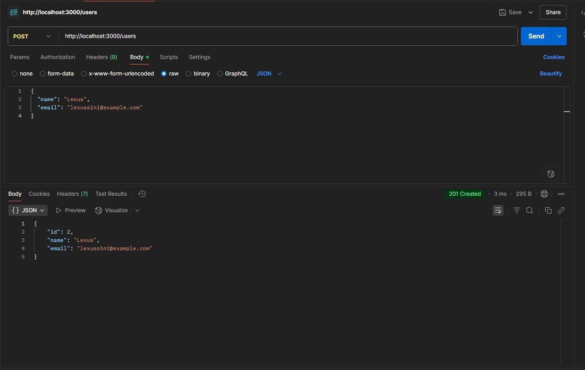
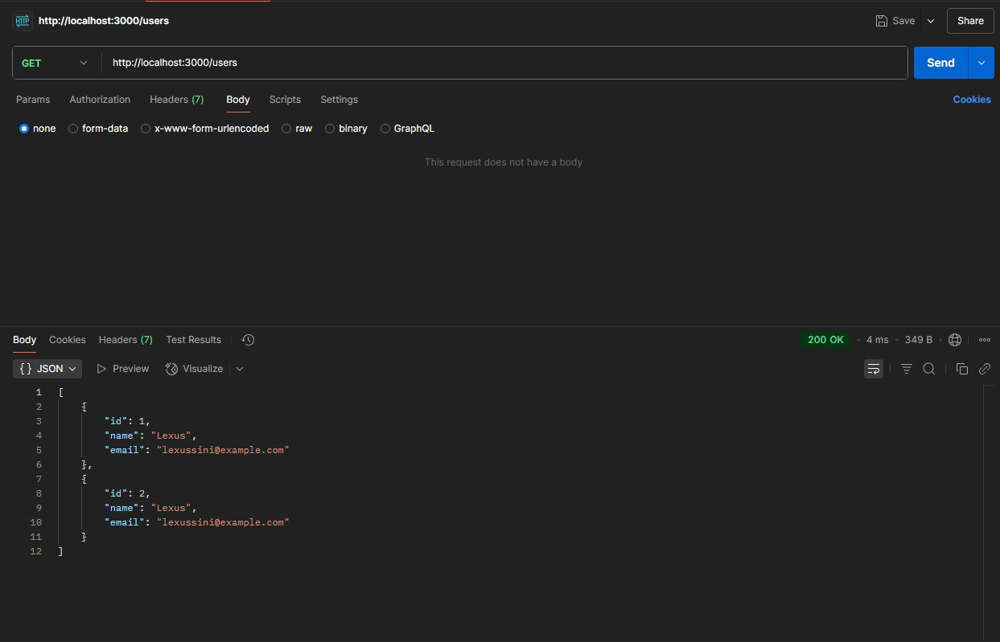

# TODO Application (Express.js)

Простое REST API для управления задачами, проектами и пользователями.

---

## Стек технологий

- Node.js
- Express.js
- In-memory хранилище
- Паттерн Repository

---

## Запуск проекта

### Клонирование репозитория

```bash
git clone <URL_репозитория>
cd <папка_проекта>
npm install
npm start
```
Сервер запустится по адресу: http://localhost:3000

## Итог


 


